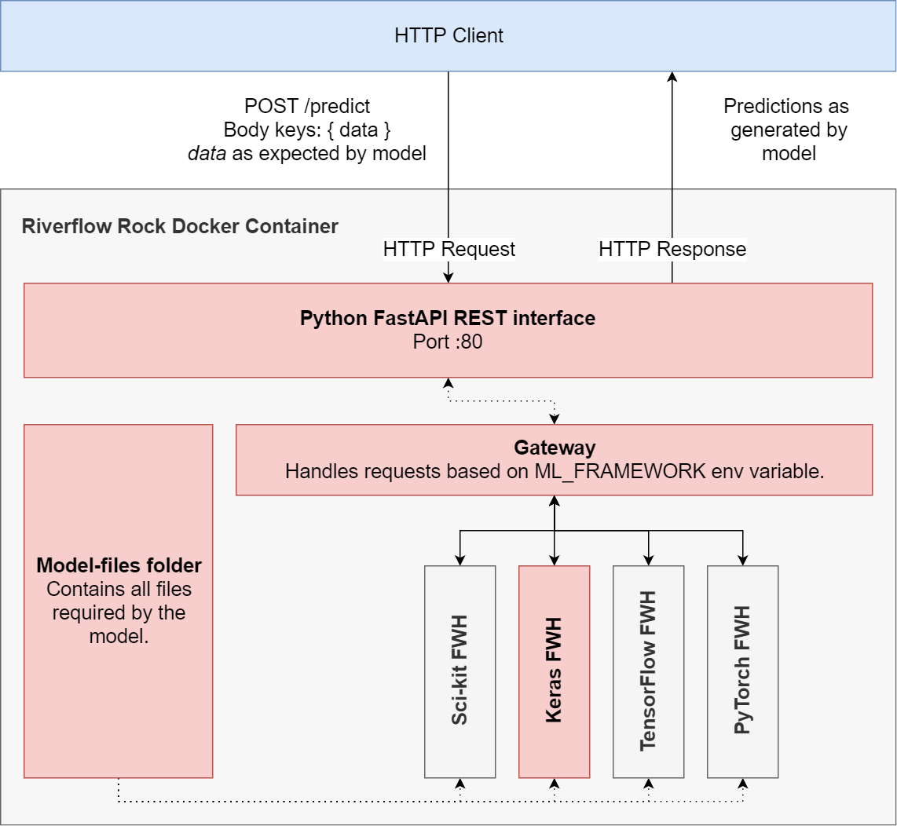

<pre>
 _____  _                 __ _               
|  __ \(_)               / _| |              
| |__) |___   _____ _ __| |_| | _____      __
|  _  /| \ \ / / _ \ '__|  _| |/ _ \ \ /\ / /
| | \ \| |\ V /  __/ |  | | | | (_) \ V  V / 
|_|  \_\_| \_/ \___|_|  |_| |_|\___/ \_/\_/  
</pre>
Containerize your AI models.

## Table of contents
- [Table of contents](#table-of-contents)
- [Rationale](#rationale)
- [Architecture](#architecture)
- [Current support](#current-support)
- [Future extensions](#future-extensions)
- [Generating Rock images](#generating-rock-images)
- [License](#license)
  
## Rationale
In the [paper](https://papers.nips.cc/paper/5656-hidden-technical-debt-in-machine-learning-systems.pdf) *Hidden Technical Debt in Machine Learning Systems* by Google, it is argued that although machine learning is a very powerful tool for building prediction systems, it comes with its intrinsic challenges. Specifically, when you build software systems, you introduce what is known as _technical debt_ - "a metaphor introduced (...) to help reason about the long term costs incurred by moving quickly in software engineering".

That is, when you develop for speed over quality, you'll introduce a lot of choices that you'll need to resolve later on. Since debt carries interest, you'll face an even larger number of issues in the long run compared to your initial engineering effort.

Machine learning, the authors argue, comes with the default software engineering debt - but also with its own set of ML-specific challenges:

* **No uniform interfaces to your models & glue code.** Machine learning models can be developed with a variety of frameworks, such as Keras, TensorFlow, PyTorch and Scikit-learn. They all offer different APIs for when you want to generate predictions. This way, all software applications that need to use these models need to implement them differently.
* **Difficult version control.** If you update your model, you need to give the current model users the choice whether they want to switch or not. By deploying the models without some kind of uniform interface, you make it difficult to distinguish between model versions.
* **Undeclared consumers.** You simply don't know who is using your model. This can be problematic if you update your model - it might not work anymore for these users, without you (or them) knowing about it. Oops.
* **Scattered pre-processing pipelines.** Likely, when you do not have uniform interfaces, you face a scattered landscape of pre-processing elements and interfaces as well.

...and perhaps this list is non-exhaustive.

A **Riverflow Rock** is AI containerization technology developed by GSWRX in the Netherlands which attempts to reduce ML technical debt by embedding ML models into an uniform interface that can be reached with REST over HTTP.

## Architecture
This is the architecture of a Riverflow Rock container:

As you can see, the container opens up a [FastAPI](https://github.com/tiangolo/fastapi) REST API. FastAPI is a "high performance, easy to learn, fast to code, ready for production" web framework for Python based APIs. The container by default opens up at port `:80`, but this can be changed in the `./docker-compose.yml` file.

Specifically, a `POST` route named `/prediction` is offered by a Riverflow Rock. It expects a POST body that at least contains the `data` parameter, which contains the data as it is expected by the model for inference. In return, the HTTP client receives a HTTP response containing model predictions.

Internally, the request is propagated to a `Gateway` which handles requests based on the `ML_FRAMEWORK` environment variable that can be passed with `./docker-compose.yml`. If none is passed, it defaults to 'keras'. Based on this environment variable, the data is passed to a specific `Framework Handler` (FWH). This framework handler loads the model files as uploaded in the `model-files` folder and bridges between the gateway and the actual model. By means of the native `predict` API for any of the available frameworks, it generates a prediction and returns the results.

By consequence, Riverflow Rocks offer uniform access to machine learning models and provide isolation during run-time. This way, we attempt to mitigate many of the risks for technical debt introduced before.

## Current support
* Basic support for Keras ([keras.io](https://keras.io)).

## Future extensions
* Authentication
* Usage statistics

## Generating Rock images
To do.

## License
Riverflow Rock technology is released with the [GNU Affero General Public License v3](./LICENSE) by default. This allows you to use Rocks commercially, to modify them, to distribute them, as well as use them for patent and private use, under the condition that the limitations and conditions as specified by the license are respected.

On a case to case basis, GSWRX B.V. can supply different licenses for Riverflow Rock powered containers. If you are interested in this, please feel free to [get in touch](https://www.degasfabriek.com/contact/).